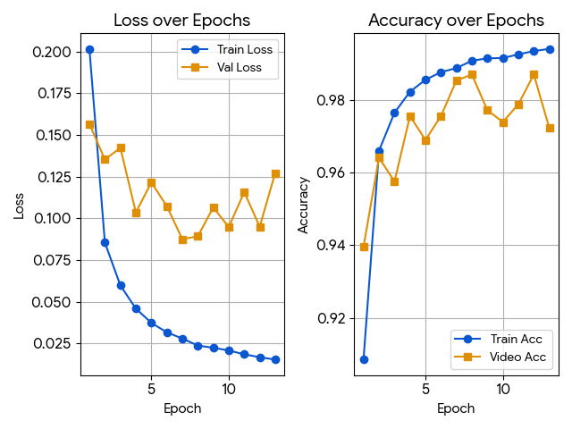

# 🕵️‍♂️ Deepfake Detection Project: Analysis of Limitations in Legacy Datasets and Domain Generalization

This project was initiated to participate in the **2026 HECTO Deepfake Detection Contest**. It involves designing a deepfake detection model and analyzing performance through various experiments.

## 📅 Project Period
* **January 2026** (1 month)

---

## 👨‍💻 Team Members & Contributions

### Jiwon Lee
* **Data Pipeline & Preprocessing**: Face detection, alignment, and extraction pipeline design (MTCNN). Conducted preprocessing for **FF++ and DF** datasets.
* **Modeling & Strategy**: 
    * Executed backbone selection experiments (ResNet, EfficientNet, ViT, ConvNeXt).
    * Implemented and validated Layer-wise Adaptive Learning Rate (**LLRD**) strategies.
    * Designed and tested the **Branch Structure Experiment** for feature map merging.
* **Performance Analysis**: Led the root cause analysis for the domain gap between training data and the leaderboard, identifying the necessity of cross-dataset validation and modern augmentation (SBI).

### Gyurie Baek
* **Data Engineering**: Managed **Celeb-DF** preprocessing and constructed consolidated **training CSV** metadata. Designed and implemented the inference pipeline for the leaderboard test set, including CSV generation for final submission.
* **Augmentation Strategy**: Developed and applied **differential augmentation techniques** tailored to each dataset’s characteristics (e.g., compensating for artifacts in DF vs. Celeb-DF).
* **Operation & Deployment**: Handled the full lifecycle of leaderboard submissions and monitored public score feedback to iterate on model performance.

---

## 📌 Project Overview
* **Background**: Designing a detection model to counter increasingly sophisticated deepfake technology.
* **Contest Rules**: Time-series information prohibited, Ensembling prohibited (Focus on single-image-based classification).
* **Key Goals**: Compare various backbone models, optimize learning rate strategies, and analyze performance based on data augmentation techniques.

---

## 📊 Dataset & Preprocessing
Rigorous preprocessing was conducted to ensure the reliability of the training data.
* **Datasets Used**: Celeb-DF, FaceForensics++ (FF++), DeeperForensics (DF)
* **Sampling**: Balanced **1:1 ratio** between Real and Fake classes.
* **Offline Preprocessing**: 
    1. **Face Detection**: Identifying face locations using the **MTCNN** algorithm.
    2. **Alignment & Cropping**: Rotating faces to a frontal view and cropping based on landmarks.
    3. **Resizing**: Standardizing input resolution for model compatibility.

---

## 🧪 Modeling Experiments

### 1. Backbone Selection
The backbone was chosen by balancing inference speed and accuracy.
* **Candidates**: `ResNet50`, `EfficientNet-B0`, `ViT-Tiny`, `ConvNeXt-Tiny`
* **Result**: **ConvNeXt-Tiny** was selected as the final backbone due to its superior baseline performance.

### 2. Layer-wise Adaptive Learning Rate (LLRD)
* **Experiment**: Global learning rate vs. Differential learning rate (Lower LR for initial layers).
* **Result**: **Layer-wise Differential LR** led to more stable convergence and higher overall performance.

### 3. On-the-fly Augmentation Strategy
* **Experiment**: Applying stronger augmentations to FF++ and Celeb-DF to balance the heavy distortion found in the DF dataset.
* **Result**: Differential augmentation strategies improved the convergence speed.

### 4. Branch Structure Experiment
* **Experiment**: Designing a branch structure that extracts feature maps from intermediate layers of ConvNeXt-Tiny, passes them through additional convolutional layers, and merges them.
* **Result**: No significant performance gain; convergence took longer due to the additional parameters.

---

## 📈 Performance & Failure Analysis

### Internal Evaluation
* **Validation Accuracy**: 0.9869
* **Validation AUC**: 0.99

### Competition Leaderboard Result
* **Public Score**: **0.6998**

### 🔍 Root Cause Analysis: Domain & Temporal Gap
Despite high internal validation, the leaderboard score dropped significantly. We analyzed the causes as follows:
1. **Dataset Obsolescence**: The training datasets (2019-2020) are outdated compared to the contest's test images, which were created with state-of-the-art (GAN, Diffusion-based) techniques.
2. **Domain Bias**: The model overfitted to the specific noise and compression artifacts of legacy datasets, failing to detect high-quality, "clean" modern deepfakes (High False Negative rate).
3. **Generalization Limits**: A simple pixel-based classification approach lacks the robustness to handle unseen generation methods.

---

## 🚀 Future Work & Development
While this joint project concludes here, we plan to further develop this model individually in the following directions:

* **Dataset Upgrade**: Incorporating modern datasets like WildDeepfake.
* **Advanced Techniques**: Implementing **SBI (Self-Blended Images)** to reduce dataset dependency.
* **Temporal Analysis**: Adding **LSTM / Transformer** blocks to capture inter-frame inconsistencies.
* **Ensemble Methods**: Combining multiple backbones to maximize generalization.

---

## 🔗 Individual Repositories (Post-Contest Development)
Check out our individual journeys as we continue to evolve this project:

* [Gyurie's Personal Lab](https://github.com/Gyuurie) 
* [Jiwon's Personal Lab](https://github.com/jiwonleelee/Deepfake-Detection-v2?tab=readme-ov-file) 
